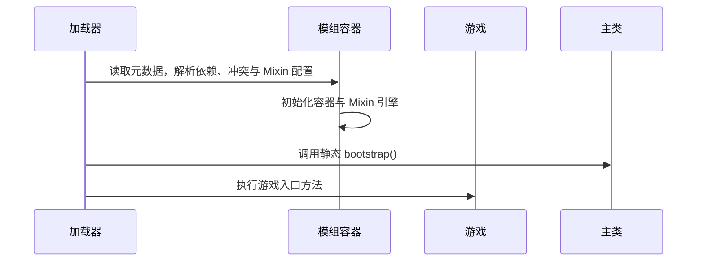
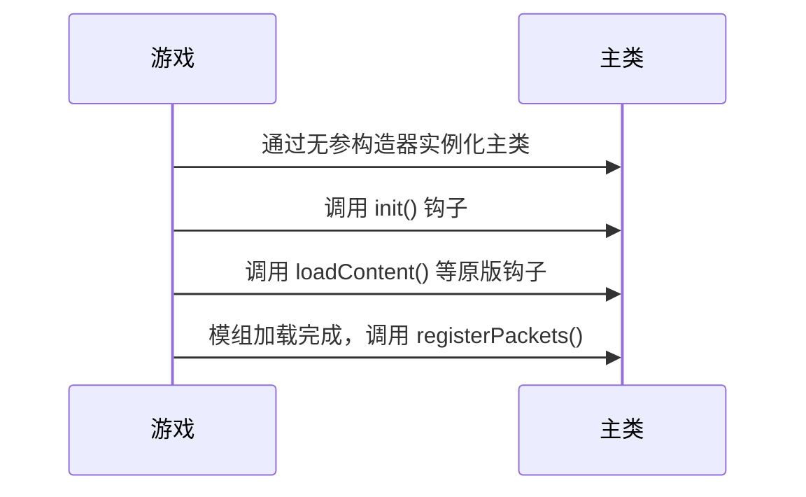

import { Aside } from '@astrojs/starlight/components';

Copper 模组的主类**必须**继承 `copper.core.mod.CopperMod`。`CopperMod` 本身继承自原版 `mindustry.mod.Mod`，也就是说，**原版 `Mod` 的全部能力都保留**，Copper 只是在其上做行为扩展。

```java
public abstract class CopperMod extends Mod {
    /** 模组加载期间调用，用于向 CopperNet 注册自定义网络数据包。 */
    public void registerPackets() {}
}
```

`CopperMod` 目前只新增了一个可覆写的方法：`registerPackets()`（见[网络数据包](/developers/networking/)），且它**是可选的**——不覆写也不影响模组加载。其余全部来自原版 `Mod`。

## 原版 Mod 的能力

你的主类可以直接覆写以下方法，行为与原版一致：

| 方法 | 时机 | 说明 |
| ---- | ---- | ---- |
| `init()` | 游戏加载内容之前 | 初始化逻辑 |
| `loadContent()` | 客户端加载内容时 | 注册游戏内容（方块、物品等） |
| `packSprites(MultiPacker)` | 贴图打包时 | 添加自定义贴图 |
| `registerServerCommands(CommandHandler)` | 服务端 | 注册服务端命令 |
| `registerClientCommands(CommandHandler)` | 客户端 | 注册客户端命令 |
| `getConfigFolder()` | 任意 | 配置文件夹 |
| `getConfig()` | 任意 | `config.json` 文件句柄 |

### 配置文件夹的差异

Copper 模组的配置文件夹被**重定向**，与原版模组不同：

- 原版 Mindustry 模组：`<数据目录>/mods/<模组名>/`；
- **Copper 模组：`<数据目录>/copper/datas/<作者-模组名>/`**（`id` 中的冒号替换为连字符）。

`getConfig()` 返回该文件夹下的 `config.json`，用法不变。

## 完整的运行生命周期

主类在什么时机被调用，决定了你该在哪一步写什么代码。整个生命周期分为两个阶段：**游戏入口方法执行之前**与**游戏加载模组时**。

### 游戏入口方法执行之前



**静态 `bootstrap()` 是 Copper 新增的生命周期钩子**：如果你的主类声明了 `public static void bootstrap()`，它会在**游戏入口方法执行之前**、主类**实例化之前**被调用：

```java
public class MyMod extends CopperMod {
    public static void bootstrap() {
        // 此时 Mixin 引擎已经就绪，但主类实例尚不存在
    }
}
```

- 时机：所有模组的容器与 Mixin 引擎都已初始化完毕，先于游戏入口方法；
- 为什么需要它：Copper 允许模组**注入游戏本身**，因此在游戏开始执行前，模组可能就需要完成必要的初始化（例如准备注入所需的数据、注册静态状态），否则等游戏跑起来再初始化就来不及了；
- 用途：进行不依赖实例的早期准备工作；
- 可选：没有声明该方法不会报错。

### 游戏加载模组时

游戏入口方法执行后，Mindustry 按原版流程加载模组。Copper 模组在这个过程中被桥接进原版模组系统：



- 主类通过**无参构造器**实例化；
- 实例化后，Mindustry 按原版时机调用 `init()`、`loadContent()` 等钩子；
- 所有启用的模组加载完成后，`registerPackets()` 被调用，用于注册网络数据包（见[网络数据包](/developers/networking/)）。

### 生命周期要点

| 钩子 | 时机 | 是否可选 |
| ---- | ---- | -------- |
| 静态 `bootstrap()` | 游戏入口之前，实例化之前 | 可选 |
| 无参构造器 | 游戏加载模组时 | 必写 |
| `init()` 等原版钩子 | 游戏加载模组时 | 可选 |
| `registerPackets()` | 模组加载完成后 | 可选 |

主类必须是 `CopperMod` 的子类，否则桥接时报 `mod main class is not a sub-class of CopperMod`。

## 桥接的细节

为了让 Copper 模组以"原生"身份出现在 Mindustry 的模组管理器中，系统做了以下行为调整，你通常不需要关心，但了解后可以解释一些现象：

- 模组在游戏内的内部名称形如 `copper-<作者-模组名>`（如 `copper-example-examplemod`）；
- 游戏版本兼容性检查**改由 Copper 的依赖系统完成**（见[版本、依赖与冲突](/developers/versions/)），原版的 `isOutdated` / `isSupported` 检查被绕过；
- Copper 模组自动获得对核心模组的依赖；
- 游戏内模组管理（移除/启停/导入）被禁用，见[管理模组](/players/manage-mods/)。

## 主类的常用写法

```java
package example.examplemod;

import arc.util.Log;
import copper.core.mod.CopperMod;

public class ExampleMod extends CopperMod {
    public static void bootstrap() {
        Log.info("bootstrap: Mixin 已就绪，游戏尚未启动，主类尚未实例化");
    }

    public ExampleMod() {
        Log.info("constructor: 主类实例化");
    }

    @Override
    public void init() {
        Log.info("init: 游戏加载模组阶段");
        Log.info("config folder: " + getConfigFolder());
    }

    @Override
    public void loadContent() {
        Log.info("loadContent: 注册内容");
    }

    // registerPackets() 可选，仅在使用自定义网络数据包时覆写
}
```

## 模组上下文工具类

`copper.core.Copper` 提供了一系列静态工具，帮助模组访问自己的文件、数据目录与设置：

| 方法 | 说明 |
| ---- | ---- |
| `Copper.getDataFolder()` | 加载器数据目录（`<数据目录>/copper`） |
| `Copper.getModsFolder()` | Copper 模组文件夹（`<数据目录>/copper/mods`） |
| `Copper.getModsDataFolder()` | Copper 模组数据目录（`<数据目录>/copper/datas`） |
| `Copper.getMod(Class)` | 通过主类查找对应模组描述符 |
| `Copper.getModNonNull(Class)` | 同上，找不到时抛异常 |
| `Copper.getModRoot(Class)` | 模组 Jar/目录的根 `Fi` |
| `Copper.getModFile(Class, path)` | 模组内任意文件 |
| `Copper.getModAssetFolder(Class)` | 模组的 `assets` 文件夹 |
| `Copper.getModAsset(Class, path)` | 模组 `assets` 下的文件 |
| `Copper.createSettings(Class)` | 创建绑定到模组数据目录的 `Settings` 实例 |
| `Copper.createBundle(Class)` | 创建多语言 bundle（见[数据、设置与本地化](/developers/data/)） |
| `Copper.translateModMeta(Class, bundle)` | 用 bundle 翻译模组元数据 |

<Aside type="note" title="包名与 id 保持一致">
	`Copper.getMod(Class)` 通过**包名前两段**推导模组 id：例如 `example.examplemod.SomeClass` 对应 id `example:examplemod`。因此请保持包名与 `id` 一致。
</Aside>

详见[数据、设置与本地化](/developers/data/)中的使用示例。
