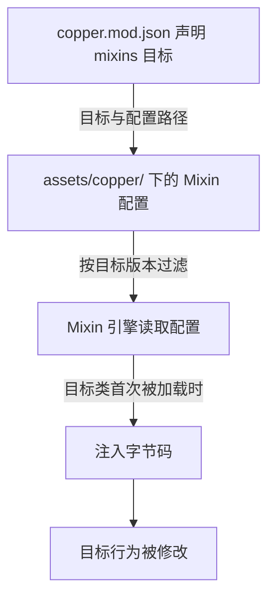

Mixin 是一套**运行时字节码修改框架**：它允许你在不改动目标类源码的情况下，把一段代码"注入"到目标类的方法中，实现热修改。Mixin 最初为 Minecraft 而生（SpongePowered Mixin），Copper 将这套框架移植到了 Mindustry。

## 为什么需要 Mixin

Mindustry 原版模组能做的修改是有限的：注册新内容、监听游戏事件、覆写 `Mod` 钩子。但有些需求原版 API 做不到，例如：

- 修改游戏**内部方法**的逻辑（比如改变某个内置方块的判定）；
- 访问或修改游戏类中的**私有字段**；
- 修改**其他模组**的行为；
- 在游戏加载流程的特定时机插入代码。

Mixin 通过字节码注入直接修改目标类的行为，让上述需求成为可能。

## Copper 的 Mixin 体系

Copper 的 Mixin 体系由三部分组成：

1. **Mixin 框架本体**（`org.spongepowered.asm.*`）：基于 SpongePowered Mixin 0.8.7 修改的版本（见[与 Minecraft Mixin 的差异](/developers/mixin/copper-differences/)）；
2. **加载器集成**：每个容器（模组/游戏）在初始化时启动 Mixin 引擎，按配置应用注入；
3. **模组侧的配置**：通过 `copper.mod.json` 的 `mixins` 字段 + `assets/copper/` 下的配置文件声明注入内容。

## 工作流程

- **注入目标**：`mindustry`（游戏）或任意已安装模组；
- **应用时机**：目标容器初始化时，Mixin 引擎就绪；目标类**首次被加载**时完成注入；
- **版本过滤**：Mixin 配置可以按目标的版本号选择不同的注入（见[配置 JSON 详解](/developers/mixin/config/)）。

## 你能注入什么

Copper 的 Mixin 支持 SpongePowered Mixin 的主流能力：

| 能力 | 说明 |
| ---- | ---- |
| `@Inject` | 在目标方法指定位置插入回调代码 |
| `@Redirect` | 重定向目标方法内的调用/字段访问/new |
| `@ModifyArg` / `@ModifyArgs` | 修改方法调用参数 |
| `@ModifyVariable` | 修改局部变量 |
| `@ModifyConstant` | 修改常量 |
| `@Overwrite` | 完全覆写目标方法 |
| `@Shadow` | 访问目标类的私有字段/方法 |
| `@Accessor` / `@Invoker` | 生成访问器/调用器接口 |
| `@Unique` | 声明成员绝不覆写目标成员，冲突时自动重命名/丢弃 |

> 完整能力请阅读[入门教程](/developers/mixin/intro/)与[注解参考手册](/developers/mixin/reference/)。

## 阅读路线

- 如果完全没接触过 Mixin，从[入门教程](/developers/mixin/intro/)开始读起；
- 已经会写 Mixin，直接看[配置 JSON 详解](/developers/mixin/config/)与[与 Minecraft Mixin 的差异](/developers/mixin/copper-differences/)；
- 需要查注解用法，查[注解参考手册](/developers/mixin/reference/)；
- 想快速看例子，看[Mixin 示例](/developers/mixin/examples/)。
