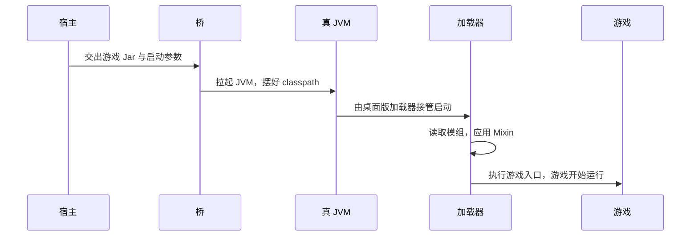

import { Aside, FileTree } from '@astrojs/starlight/components';

[android-bridge](https://github.com/MDTCopper/android-bridge) 是 Android 上的**另一条实现路线**：它在设备上起一个**真 JVM**，直接运行**桌面版**游戏 Jar 与**桌面版**加载器。本文面向需要理解或接入这条路线的人——宿主开发者、以及要判断「某个游戏版本该走哪条路」的维护者。玩家侧不需要这些，见[使用移动版](/zh/players/mobile/)。

另一条路线见 [Android（ART）平台](/zh/developers/android-art/)。

## 与 ART 路线怎么选

| | ART 路线 | android-bridge 路线 |
| ---- | ---- | ---- |
| 游戏版本兼容性 | **好**：一套实现能覆盖很多版本 | 要跟着游戏版本走，游戏侧的形状一变就得重新适配 |
| 维护成本 | **低**，不需要怎么维护就能支持很多版本 | **高**，需要经常维护 |
| 游戏跑在哪 | 直接跑在 **ART** 上 | 桥起一个真 JVM，跑桌面版本体 |
| 启动速度 | 首次要先构建 dex 缓存 | **不需要预先构建**，装好即启动 |
| 性能与功耗 | **好**：ART 是面向移动端优化的 Java 运行时，直接跑在上面有成效 | 可能打一些折扣 |
| Mixin | 构建期注入 | **运行期**注入，与桌面版完全一致 |
| 载荷 | 游戏 Jar + 游戏源码包（在设备上 dex 化） | JRE + arc 原生库 + `bridge.jar` |
| 换模组之后 | 必须重新构建缓存 | 重新启动即可 |

一句话：**要覆盖尽量多的游戏版本、看重性能与功耗，走 ART；要桌面版本体原样运行、要 Mixin 与桌面完全一致、要启动快，走桥。** 桥的代价是版本适配要持续跟进。

## 这条路线跑什么



桥自己**不认识模组**：它只负责起 JVM、摆好 classpath、起游戏。模组能力来自被它启动的桌面版加载器，所以 Mixin 等修改器的行为与桌面版完全一致。

## 支持范围

| 项目 | 范围 |
| ---- | ---- |
| Android | **11（API 30）及以上** |
| ABI | `arm64-v8a`、`armeabi-v7a`、`x86_64` |
| 游戏版本 | 官方发行版 **146.0 及以上**，BE 构建号 **24369 及以上**（两套编号各自独立，互不可比） |
| 游戏 Jar | 必须是**带资源的桌面版**；只有类的那种跑不起来 |

<Aside type="note" title="32 位 ARM">
	JDK 25 在 32 位 ARM 上不提供 G1 垃圾回收器，而桥默认会注入 `-XX:+UseG1GC`，会让 JVM 直接崩。这一档要用 `-J -XX:+UseSerialGC`（一句话既选了 GC、又让桥的 G1 那组不再注入）或 `--no-jvm-args`；启动器会为这类设备自动补上。
</Aside>

## 宿主与载荷

桥是「一个 jar」，但**不携带跑游戏需要的一切**。宿主必须提供下面这些，全是绝对路径：

| 载荷 | 参数 | 说明 |
| ---- | ---- | ---- |
| 游戏本体 Jar | `-G <path>` | 带资源的**桌面版**。它自带 arc 与 assets，不用另外给 arc 的 Java 包 |
| JRE | `--java <jre>/bin/java` | Android 版 OpenJDK 25 |
| arc 原生库 | `--arc-lib <dir>` | 原生实现（`.so`），**不是** Java 包。缺了游戏能起，但会缺掉一部分依赖原生实现的功能（例如声音） |
| `bridge.jar` | 由组件工厂追加 `--bridge-jar` | **不要自己传这个参数** |
| 加载器 | `-L` / `--loader-jar` | 要模组或 Mixin 时用，见下文 |
| （可选）ANGLE | `--angle` 或 `--angle-path <dir>` | 只给 GL 驱动有问题的设备 |

<Aside type="note" title="arc 原生库要和本体同源">
	原生库必须与本体 Jar 里的 arc 是**同一个版本**，否则往往不是启动就炸，而是第一次用到才炸。Host 应从该版本游戏 Jar 的 `version.properties` 取 `commitHash`，再去 Mindustry 的 `gradle.properties` 查 `archash`；查不到时桥会照常启动，但游戏会缺掉一部分依赖原生实现的功能（例如没有声音）。
</Aside>

## 启动参数

| 选项 | 值 | 必需 | 说明 |
| ---- | ---- | ---- | ---- |
| `-G`, `--game-jar` | path | ✅ | 游戏 Jar / 额外 classpath Jar，可重复；**顺序有意义** |
| `-D`, `--game-data` | path | ✅ | 游戏数据目录：存档、设置、模组、`last_log.txt` |
| `-C`, `--cache-path` | path | ✅ | 桥的运行期目录：抽出的原生库与 `tmp` |
| `--java` | path | ✅ | Android JRE 的 `bin/java`，不是桌面 JDK |
| `--arc-lib` | path | 实际必需 | arc 原生库目录 |
| `-L`, `--loader-jar` | path | | 注入加载器的 Jar，可重复；**顺序即 classpath 顺序** |
| `--main` | class | | 注入加载器的主类（配 `-L` 用） |
| `--bridge-jar` | path | | 宿主加载桥的那份 Jar，**只由组件工厂追加** |
| `--gl3` / `--gl2` | flag | | 请求 OpenGL ES 3（默认）/ ES 2 |
| `--abi` | abi | | 一般不用给：不传时按设备认；只在排查「载荷与设备对不上」时覆盖 |
| `-J`, `--jvm-args` | arg | | **一条一个** `-J`，可重复 |
| `--no-jvm-args` | flag | | 关掉桥注入的 JVM 调优参数 |
| `-d` / `--verbose` | flag | | 桥自己的日志开到 `[D]` / `[V]` |
| `--logcat` | flag | | 除文件外也写 Android log；不加就只有 `[E]` 行会进 logcat |
| 裸词 / `--` 之后 | | | 位置参数：直接给游戏；注入加载器时先给加载器 |

<Aside type="note" title="`--` 是唯一的口子">
	桥的解析器遇到**不认识的、以 `-` 开头的词会直接报错**，所以加载器选项与游戏的 `-` 参数都不能直接写在向量里。桥和加载器各自认一次 `--`，因此要套两层：

	```text
	--loader-jar wrapper.jar --loader-jar desktop.jar --main copper.wrapper.Main \
	  -- --vanilla -- -width 800
	```

	桥自己的选项必须写在第一个 `--` **之前**；加载器的选项写在**第二个** `--` 之前，给游戏的参数放第二个 `--` 之后。
</Aside>

## 加载器与模组

桥本身不认识模组，要让游戏跑在 Copper 上就得让桌面版加载器先接管启动。给 CopperLoader 写的适配器是 [loader-wrapper](https://github.com/MDTCopper/loader-wrapper)，做法是把两个 Jar 交给桥，并让适配器当主类：

```text
--loader-jar loader-wrapper-<版本>.jar
--loader-jar desktop-<版本>.jar
--main copper.wrapper.Main
```

- `-L` 的顺序**就是 classpath 顺序**：适配器在前（它是主类），加载器桌面 Jar 在后；
- wrapper 把桥给的 classpath 原样翻译成加载器自己的 `--game-jar`，加载器随后接管启动——读取模组、建立 Mixin 引擎，最后回到桥的入口把游戏起来；
- 加载器自己的选项（`--vanilla`、`-d`、`--mixin-log` 等）因此能直接从启动参数给，剩下的交给游戏本体；
- 模组放在 `<数据目录>/copper/mods/` 与 `<数据目录>/mods/`，与桌面版一致。

<Aside type="note" title="不用加载器时">
	不带 `-L` 启动就是纯粹的原版桌面版游戏。加载器的原版模式（`--vanilla`）在这条路上同样可用，含义见[加载器命令行 · 原版模式](/zh/developers/cli/#原版模式)。
</Aside>

## 文件布局

桥的库多版本共用，每个版本只各占一份自己的运行期目录与数据目录：

<FileTree>
- 数据根/
	- bridge/ — 桥的库（各版本共用）
		- `bridge-<版本>.jar` — 桥本身
		- jre/ — Java 运行环境（按设备架构装一次）
		- `arc/<arc 引用>/<架构>/` — arc 原生库，按游戏版本用到的 arc 分开存放
	- `<版本目录>/`
		- data/ — 该版本的游戏数据目录（存档、设置、模组、日志）
		- bridge/cache/ — `-C`：桥为这个版本摆出来的运行期文件
</FileTree>

## 宿主必须注意

1. **放 `--arc-lib`、`--angle-path` 的目录必须可写。** 桥要在里面把 `.so` 改成「可执行 + 只读」（Android 的 W^X 限制：被加载的库不能带写位、必须有执行位）。目录只读时改不动，加载就可能失败。
2. **换载荷要先删旧文件。** 被改成只读之后原地覆盖写不进去；arc 原生库、JRE 的库、`--angle-path` 那两份都这样。桥自己在 `-C` 里放的文件不用管，它按内容比对，不一样就重写。
3. **一个进程只能有一个 JVM。** 第二次启动前必须让上一次的进程死掉，否则报 `UnsatisfiedLinkError: … already opened by ClassLoader 0x…`。宿主应在每次启动前清掉残留进程。
4. **失败怎么呈现。** 参数错、Jar 缺失这类错误会同步报回宿主；之后的失败发生在游戏进程里，宿主收不到回调，只能看 `<游戏数据目录>/last_log.txt` 或占位界面的堆栈。

## 常见问题

### 点击启动后界面回来，什么都没发生

**原因**：组件工厂没被命中——占位 activity 的类名与清单条目、启动时用的类名不是逐字符相同。

### 弹出堆栈界面

**原因**：参数非法、Jar 缺失、ABI 不符……读堆栈第一行。

### `failed to initialise the native bridge` / `is for EM_… instead of EM_…`

**原因**：ABI 不一致——JRE、arc 原生库、`bridge.jar` 必须同为一种 ABI。

**解决**：载荷里放一份 ABI 记录，启动前和设备自己报的 ABI 比一下。

### 游戏能跑，但少了功能（例如没有声音）

**原因**：该版本的 arc 原生库没取到，依赖原生实现的功能会缺失。

**解决**：按本体的 `commitHash` 查 `archash` 后补下对应的 `.so`。

### 日志里只有 `failed to start the JVM` 和一段堆栈

**原因**：多半是 `--arc-lib` 没给、或目录里没有 `.so`。

### 换了 arc 原生库 / JRE / ANGLE 之后跑的还是旧的

**原因**：旧文件已被改成只读，覆盖没写进去。先删掉旧文件再放新的。

### 日志在哪里

一份 `<游戏数据目录>/last_log.txt`，每次启动清空一次，桥与游戏的输出都在里面（游戏设置里的「导出日志」读的也是它）。要在 logcat 里同时看，必须传 `--logcat`。
