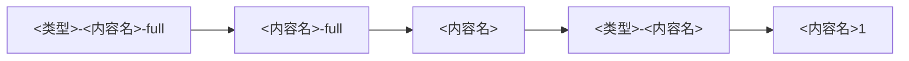

import { Aside } from '@astrojs/starlight/components';

Copper 模组在 Mindustry 的模组系统里以「原版模组」的身份出现，但名字并不是 `copper.mod.json` 里写的 `id`。本页把这层映射集中列出来——写依赖、拼 bundle 键、给贴图起文件名时都会用到。

## 模组名

规则只有一条：把 `id` 里的冒号换成连字符，前面加 `copper-`。

| `copper.mod.json` 里的 `id` | 原版模组系统里的名字 |
| ---- | ---- |
| `example:examplemod` | `copper-example-examplemod` |
| `copper:core`（核心模组） | `copper-copper-core` |

<Aside type="note" title="大小写会被改写">
	游戏注册模组时还会把名字转成**小写**、把空格换成连字符。Copper 的 `id` 本来就禁止空格与连字符，所以实际只有大写字母会受影响——同一个模组不会因为 id 里的大小写不同而出现两个名字。
</Aside>

## 依赖名

元数据里声明的依赖，翻译成原版模组系统的依赖时按下面处理：

| `dependencies` 里写的 id | 对应的原版依赖 |
| ---- | ---- |
| `mindustry:<模组名>` | `<模组名>`（原版模组自己的名字，不加前缀） |
| 其他任何 id（含其他 Copper 模组） | `copper-<id 冒号换连字符>` |
| `copper:core` | 不单独生成——每个 Copper 模组都自动依赖 `copper-copper-core` |
| `mindustry` / `loader` | 不生成（游戏本体与加载器由 Copper 自己检查） |

所以要依赖一个**原版 Mindustry 模组**就写 `mindustry:<模组名>`，它进入原版依赖表时会被还原成那个模组本来的名字。类可见性上的额外要求见[类隔离机制](/zh/developers/class-visibility/)。

## 内容名与 bundle 键

模组注册的内容（方块、物品、单位……）都会带上模组名作为前缀：

```
<模组名>-<你在代码里给的名字>
```

例如 `example:examplemod` 注册一个名为 `myblock` 的方块，内容名就是 `copper-example-examplemod-myblock`。

游戏显示这些内容时**从全局 bundle 取文本**，键由「内容类型 + `.` + 内容名 + 后缀」拼成：

| 键 | 用途 |
| ---- | ---- |
| `block.copper-example-examplemod-myblock.name` | 名称 |
| `block.copper-example-examplemod-myblock.description` | 描述 |
| `block.copper-example-examplemod-myblock.details` | 详情 |
| `block.copper-example-examplemod-myblock.credit` | 致谢 |

内容类型就是原版的 `ContentType` 名：`block`、`item`、`unit`、`liquid`、`status`、`weather`、`sector`、`planet`、`team` 等。

这些键要写在**游戏的全局 bundle** 里，也就是模组的 `assets/bundles/bundle_<语言>.properties`，而不是 Copper 自己的 `assets/copper/bundles/`（区别见[数据、设置与本地化 · 多语言本地化](/zh/developers/data/#多语言本地化)）。

## 贴图文件名

放在 `assets/sprites/` 下的图片，注册到 Atlas 时会自动加上 `<模组名>-` 前缀：

| 文件名 | 注册出来的区域名 |
| ---- | ---- |
| `myblock.png` | `copper-example-examplemod-myblock` |
| `block-copper-example-examplemod-myblock.png` | 原样使用（见下） |

<Aside type="note" title="已经带前缀的名字不会再加一遍">
	文件名里含连字符，且**第一个连字符之后**以 `<模组名>-` 开头时，游戏认为这个名字已经带过前缀，不再重复添加。原版内容贴图的习惯写法是把类别放在最前面（`block-…-full`），照这个写法命名既能保证区域名与内容名对齐，也能让 `-full`、`-ui` 这些变体按同一套规则被找到。

	注意前缀要写**完整的模组名**：`block-myblock.png` 会被加成 `copper-example-examplemod-block-myblock`，与内容名对不上。
</Aside>

内容图标按固定顺序查找，命中哪个就用哪个：



所以只写 `myblock.png` 也能显示（命中第三档），但要带上 `-full` 这类变体就应按第一档命名。

## 文件与目录

| 位置 | 路径 |
| ---- | ---- |
| 模组的原版资源根 | Jar 内的 `assets/` |
| 游戏显示的文本（全局 bundle） | `assets/bundles/bundle_<语言>.properties` |
| 贴图 | `assets/sprites/` |
| Copper 自己的资源（Mixin 配置等） | `assets/copper/` |
| 模组数据目录 | `<数据目录>/copper/datas/<作者-模组名>/` |

`<作者-模组名>` 就是 `id` 把冒号换成连字符，与模组名用的是同一个串，只是不带 `copper-` 前缀。完整目录速查见[数据、设置与本地化 · 文件目录速查](/zh/developers/data/#文件目录速查)。
